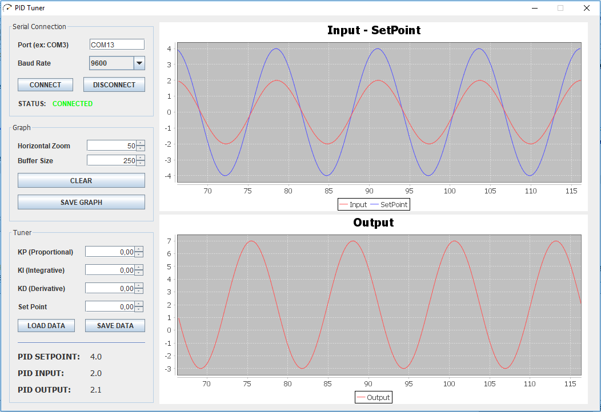

# Supervisório PID


Uma das grandes dificuldades na hora de utilizar um controle PID, é encontrar os valores dos ganhos proporcional, integral e derivativo: Kp, Ki e Kd respectivamente.

Por este motivo, vos apresento este supervisório que permite a visualização da saída, entrada e setpoint por meio de gráficos plotados em tempo real, além de possibilitar o ajuste das constantes também em tempo real!

Este supervisório foi programado na linguagem Java com o [Netbeans](https://netbeans.org/), e se comunica com o microcontrolador via protocolo USB<>Serial.



## Instruções de uso

A Interface é dividida em 4 partes:

- **Serial Connection**

**`Port`**: Porta COM onde seu dispositivo está conectado.

**`Baud Rate`**: Velocidade de comunicação Serial.

**`CONNECT`**: "Abre" a comunicação USB.

**`DISCONNECT`**: "Fecha" a comunicação USB.

**`STATUS`**: Informa o status da conexão (*CONNECTED, DISCONNECTED ou ERROR OCCURRED*)


- **Graph**

**`Horizontal Zoom`**: Quantidade de pontos mostrados na tela.

**`Buffer Size`**: Tamanho do buffer que guarda os pontos mostrados.

**`CLEAR`**: Limpa os pontos do gráfico.

**`SAVE GRAPH`**: Salva os gráficos em um arquivo excel para análises posteriores.


- **Tuner**

**`KP (Proportional)`**: Envia o Ganho Proporcional pela conexão USB sempre que há uma alteração no valor.

**`KI (Integrate)`**: Envia o Ganho Integrativo pela conexão USB sempre que há uma alteração no valor.

**`KD (Derivative)`**: Envia o Ganho Derivativo pela conexão USB sempre que há uma alteração no valor.

**`Set Point`**: Envia o Set Point pela conexão USB sempre que há uma alteração no valor.

**`SAVE DATA`**: Salva os ganhos PID no local especificado pelo usuário.

**`LOAD DATA`**: Carrega os ganhos PID que foram previamente salvos.


- **Plotting**

Lugar onde os dados são visualizados.

OBS: Clicando com o botão direito do mouse sobre um gráfico, é possível a alteração de alguns parâmetros.


## Protocolo de comunicação

Para realizar a comunicação *Computador <-> Microcontrolador* criei um protocolo muito simples de ser implementado.

**_Microcontrolador -> Computador_**

Os dados a serem enviados ao computador são 2: a `Entrada` e a `Saída`. E devem ser enviados da seguinte forma:

**Entrada:** `'I' + valor + '\n'`

**Saída:** `'O' + valor + '\n'`

Vamos ver um exemplo com a linguagem C para ficar mais claro!

```c
...
printf("I%.1f\n", input);
printf("O%.1f\n", output);
```

**_Computador -> Microcontrolador_**

Os dados que podem ser lidos com o microcontrolador são 4: `KP`, `KI`, `KD` e `SetPoint`. Os mesmos são enviados da seguinte forma:

**KP:** `'P' + valor + '\n'`

**KI:** `'I' + valor + '\n'`

**KD:** `'D' + valor + '\n'`

**SETPOINT:** `'S' + valor + '\n'`

Desta vez vamos mostrar uma função, que poderia ser usada, com uma pequena adaptação, para realizar a leitura dos dados:

```c++
String parameter = "", data = "";

void function(){
	if(SerialAvailable()){					// Verifica se os dados estão disponíveis
		char inChar = (char) ReadSerial();		// Guarda o caractere lido

		if (inChar == '\n'){				// A mensagem chegou ao fim?
								// -- Sim!
			float value = data.toFloat();		// Converte o valor lido de String para Float

			if(parameter.equals("P")){
				float KP = value;
			}else if(parameter.equals("I")){
				float KI = value;
			}else if(parameter.equals("D")){
				float KD = value;
			}else if(parameter.equals("S")){
				float SP = value;
			}

			parameter = "";	data = "";		// Limpa buffer

		}else{						// -- Não!
								// Concatena dados
			if(isAlpha(inChar))	parameter = inChar;
			else			data += inChar;
		}
	}
}
```

## Abrindo a GUI

Finalmente, o que é necessário fazer para abrir a interface?!

Descompacte o arquivo [PIDTuner.zip](https://github.com/AsafeSilva/PID-Tuner-Controller/PIDTuner/PIDTuner.zip), abra o arquivo `PIDTuner.jar` e Bom Trabalho!

Caso seu computador não reconheça o arquivo *.jar*, tente instalar a [JRE](http://www.oracle.com/technetwork/pt/java/javase/downloads/jre8-downloads-2133155.html)


**Espero ter ajudado!**

Caso encontre algum erro, ou queira fazer alguma contribuição, por favor, contate-me!