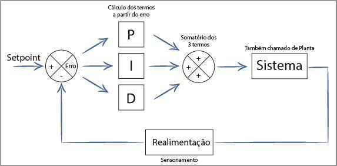

# PID-Tuner-Controller

Um supervisório mais uma biblioteca em C e C ++ para controle PID!

## *Um pouco sobre PID*

Muitos sistemas industriais e não industriais, como alguns processos que dependem, por exemplo, de um controle de temperatura ou da velocidade de um motor, necessitam de um controle mais otimizado que, por exemplo, um controle On/Off. Quando se tem a necessidade de manter essas grandezas sempre num valor constante, sem muitas oscilações e munidos a distúrbios, normalmente é utilizado a técnica de controle PID (Proporcional, Integral e Derivativo).

O controlador PID, pode ser utilizado no controle de uma vasta gama de aplicações. Pode ser usado para controlar a temperatura de uma estufa; controlar a posição de um atuador, seja ele pneumático, hidráulico ou eletromecânico; controlar a estabilidade de um Drone; controlar a vazão de um certo líquido ou o nível em um determinado reservatório; controlar a tensão numa fonte chaveada, e muitas outras situações.

O PID nada mais é que uma equação matemática, que se encarrega de controlar precisamente uma variável de um processo, com a finalidade de tornar o sistema estável, mesmo ocorrendo perturbações que afetariam toda a estabilidade.

O controle PID, como já citado anteriormente, é a combinação de três termos: proporcional, integral e derivativo. Cada um desses elementos tem uma tarefa diferente no conjunto e possuem um efeito na funcionalidade do sistema controlado. Para entender melhor o que é cada termo, vamos tomar como base uma situação onde existem dois carros numa pista (se movendo), e o motorista do carro de trás (motorista A) deseja manter uma distância definida (distância X) do carro que está na frente.

Todos os três termos do controlador PID, tem como base para o cálculo, o que se denomina de erro. Para entender o que é o erro, basta fazer a seguinte pergunta: “Quanto falta para chegar ao objetivo?”. Na situação dos carros seria, “Quantos metros faltam para chegar à distância X?”. A resposta dessas pergunta é o erro. O cálculo do erro se baseia no Setpoint (valor desejado) e no valor Atual, que matematicamente pode ser escrito como: *Erro = Valor Desejado - Valor Atual*.
	Continuando com o exemplo dos carros, vamos entender o efeito de cada termo.

- Proporcional:

O objetivo do motorista A, é manter o seu carro numa distância X. Se essa distância começa a aumentar, ele deverá acelerar **proporcionalmente ao erro** para retornar à distância X. Agora, se ele acelerar muito, vai acabar passando da distância X, fazendo com que ele precise desacelerar, apertando no freio do carro. Continuando com o raciocínio, se o motorista frear muito, terá que novamente acelerar para retornar ao ponto X. Essa “força” de aceleração e desaceleração é justamente o que se chama de **ganho proporcional**. Com um ganho adequado o motorista A vai conseguir manter uma distância bastante próxima ao valor desejado. No entanto, com um valor não apropriado pode-se perceber uma oscilação no sistema.

- Integral:

Para a ação integral, vamos supor que só a ação proporcional não conseguiu manter a distância exata, mas sim, um pouco maior. Nesta situação, a integral seria o equivalente ao motorista A ir pressionando lentamente o acelerador até alcançar a distância X, assim conseguindo manter essa distância muito mais suavemente quando só era aplicado o termo proporcional, claro, com um **ganho integral adequado**.

- Derivativo:

O termo derivativo proporciona ao sistema uma ação que se antecipa ao erro, pois ele leva em consideração a taxa de variação do erro, ou seja, ele pode produzir mais cedo ao processo, com um **ganho proporcional apropriado**, uma correção, antes que o valor do erro tome um valor não desejado. No exemplo dos carros, seria o motorista A perceber que a distância X está crescendo ou diminuindo muito rapidamente e impedir que o erro fique maior através da aceleração ou desaceleração antecipada.

A junção de todos esses termos e conceitos pode ser compreendida de forma genérica analisando o seguinte esquema.

## Referências

Para explicações mais detalhadas, além de uma pesquisa geral no *google*, você pode dar uma lida nos seguintes links:

Freitas,	Carlos.	**Controle	PID	em	sistemas	embarcados**.	Disponível	em
<www.embarcados.com.br>. Acesso em 5 de Dezembro de 2016.

MicroControlado. **Controle PID com aproximação Digital para utilização no PIC**. Disponível em <www.microcontrolado.com>. Acesso em 7 de Dezembro de 2016.

National Instruments. **Explicando a Teoria PID**. Disponível em < www.ni.com >. Acesso em 7 de Dezembro de 2016.

Silveira, Cristiano. **O Controle PID de Forma Simples e Descomplicada**. Disponível em <www.citisystems.com.br>. Acesso em 20 de Dezembro de 2016.

Wescott, Tim. **PID Without a PhD**. Embedded Systems Programming. Outubro de 2000. Disponível em < www.embedded.com>.
